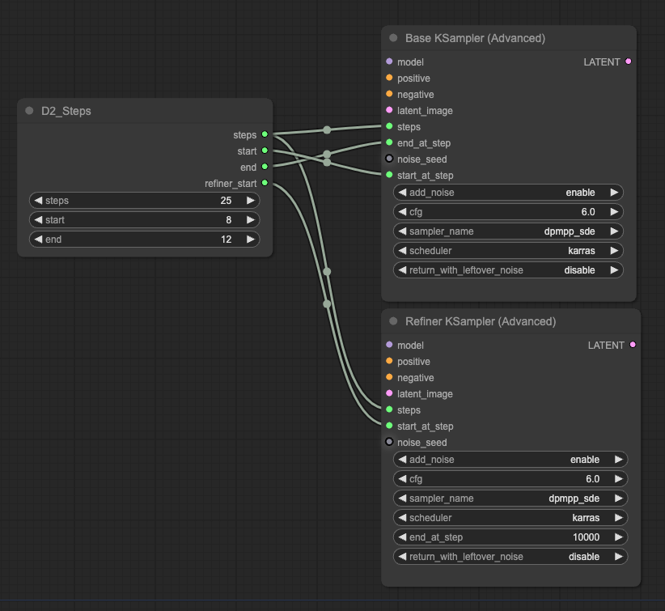

# D2 Steps

Refiner（途中で別のcheckpointに切り替える）をする時にちょっと便利なカスタムノード

- ベースcheckpointの `end` を指定すると `end + 1` した `refiner_start` が取り出せる
- 出力はINT 固定なので、便利カスタムノード `Anything Everywhere?` に渡すことが可能
- 数値を出力しているだけなので他の用途にも使える

## 説明

### steps
- KSampler Advancedの `steps` に繋ぐ。

### start
- ベースとなるcheckpointの開始step。
- KSampler Advancedの `start_at_step` に繋ぐ
- txt2imgの時は `0` を指定する（繋がなくてもよい）
- img2imgの時はここを調整すれば `denoise` と同じ効果になる

### end
- ベースとなるcheckpointの終了step。
- KSampler Advancedの `end_at_step` に繋ぐ

### refiner_start
- `end + 1` したものが取り出せる
- Refiner側のKSampler Advancedの `start_at_step` に繋ぐ

