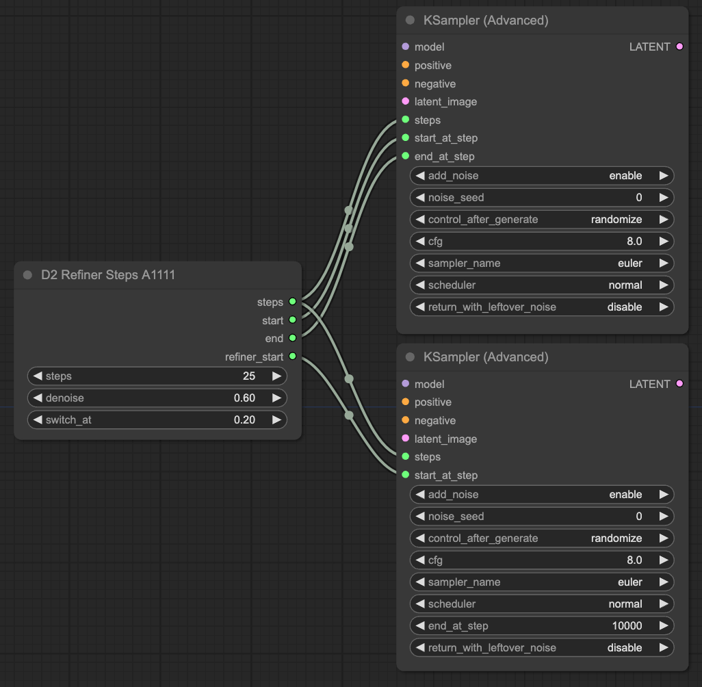
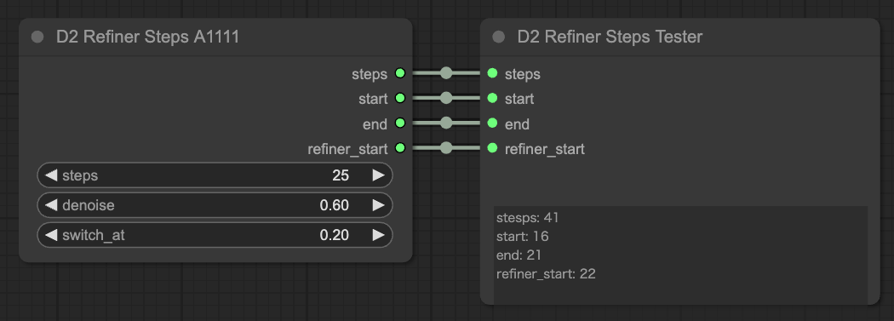
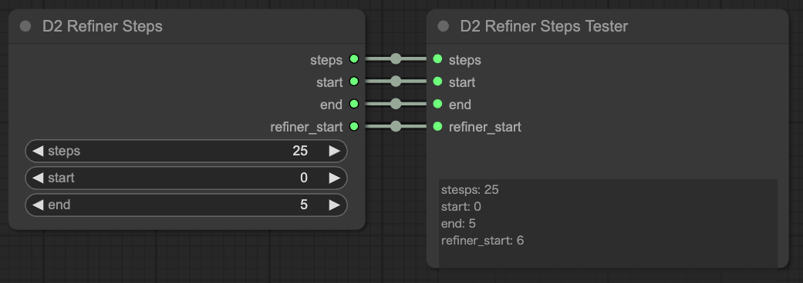

# D2 Refiner Steps

Refiner（途中で別のcheckpointに切り替える）をする時にちょっと便利なカスタムノード。

以前 `D2 Steps` という名前でしたが変更しました。

- img2img で使うことを考慮して `denoise` を指定できる
- StableDiffusion webui AUTOMATIC1111版（以下A1111） のように `switch_at` で割合を指定できる
- 自分で数値指定することもできる
- 出力はINT 固定なので、便利カスタムノード `Anything Everywhere?` に渡すことが可能

## Custom Nodes

### D2 Refiner Steps A111

- A1111と同じように、`switch_at` で開始位置を指定できる（0〜1）
- img2imgを使う時は `denoise` を指定できる

### D2 Refiner Steps

- 自分で開始step、切り替えstepを指定できる

### D2 Refiner Steps Tester

- 出力される数値を確認するためのノード
- 使う必要は無い

## Output

### steps
- KSampler Advancedの `steps` に繋ぐ。

### start
- ベースとなるcheckpointの開始step。
- KSampler Advancedの `start_at_step` に繋ぐ

### end
- ベースとなるcheckpointの終了step。
- KSampler Advancedの `end_at_step` に繋ぐ

### refiner_start
- `end + 1` したものが取り出せる
- Refiner側のKSampler Advancedの `start_at_step` に繋ぐ

## Licese

MIT
